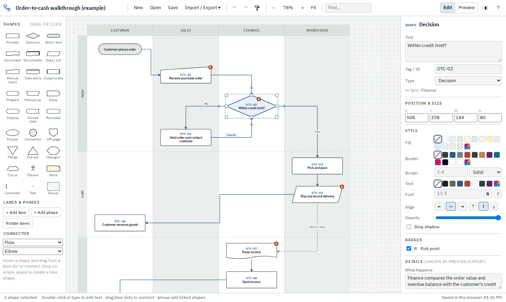

# Lagos — flowchart & swimlane editor

Lagos is a flowchart editor that runs entirely in your browser from **one HTML file**. No install,
no account, no server, and no internet connection needed. It is built for process walkthroughs:
swimlanes, phases, step numbers, risk markers and a click-to-see-details view you can share.



## Download and use

1. **Download** [`flowchart-editor.html`](../../releases/latest/download/flowchart-editor.html) from the
   [latest release](../../releases/latest).
2. **Double-click it.** It opens in Chrome, Edge, Firefox or Safari, online or offline.
3. Start from **New** (templates), **Import / Export → Import spreadsheet**, or double-click the canvas.

Your work is saved automatically in that browser. Use **Save** to keep a `.json` copy you can re-open,
share or put under version control, and **Import / Export** to publish:

| Export | What you get |
| --- | --- |
| Interactive HTML page | One file anyone can open: the chart, legend and a click-to-see-details panel. Fonts built in. |
| Interactive HTML page, smaller | The same, using the reader's own fonts (about 210 KB smaller). |
| SVG / PNG | Images with title, subtitle and legend, for documents and slides. |
| JSON | The editable document. Exported HTML pages can also be re-opened for editing. |

If GitHub Pages is enabled for this repository, the editor also runs online at
`https://<owner>.github.io/lagos/`.

## What it does

- **Shapes** — 27 flowchart shapes: process, decision, start/end, document, data/transfer, manual input,
  data store, subprocess, delay, off-page connector, notes, text, group frames and more.
- **Swimlanes and phases** — lanes as columns or rows; phases as bands across them (stages, sub-processes
  or business days). Rename, recolour, reorder and resize them; shapes move with their lane.
- **Connectors** — routed automatically around shapes, or straight or curved. Drag segments to reroute,
  drag ends to reconnect, drag labels along the line. Named connector types (e.g. *Flow* and a dashed
  *Information feed*) drive the legend.
- **Step details** — define your own fields (e.g. *What happens*, *System*, *Risk point*), highlight the
  important ones, and add badges such as a red **R** and step numbers like `STEP-08`. Readers click a
  shape (or connector) in the exported page to see its details.
- **Fast editing** — arrows next to a selected shape add the next step (hover to pick its type), type to
  replace text, format painter, snapping and alignment guides, align/distribute, auto-numbering,
  auto-layout, copy/paste, undo/redo, search and a right-click menu. Press `?` for all shortcuts.
- **Works on large charts** — stays responsive with hundreds of shapes and connectors.

## Import a spreadsheet

**Import / Export → Import spreadsheet** reads `.xlsx`, `.csv` and `.tsv` files, or rows pasted from
Excel or Google Sheets. Use one row per step; these columns are recognised automatically (you can
re-map them in the import dialog):

| Column | Meaning |
| --- | --- |
| Step | Step number, e.g. `P2P-04` (shown on the shape and used to link steps) |
| Activity | The text in the shape |
| Owner / Role / Team | The lane |
| Phase / Stage | The phase band |
| Type | Shape: `process`, `decision`, `start`, `end`, `document`, `data`, `manual input`, `data store`, … |
| Next | Following step(s), separated by `;`, with optional labels: `Yes: P2P-05; No: P2P-02`. Prefix `~` for a dashed information feed. |
| anything else | Becomes a detail field. Columns with "risk" in the name are highlighted and add the R badge. |

The dialog has an example and a downloadable example CSV to start from. There is also
**Import from text outline** for quick sketches.

## Security and privacy

Lagos makes **no network requests**, and the browser enforces this:

- All code, styles and fonts are inside the file. The IBM Plex fonts are embedded
  (licence: [`src/fonts.LICENSE.txt`](src/fonts.LICENSE.txt), SIL Open Font License 1.1).
- The editor and every exported page carry a Content-Security-Policy (`default-src 'none'`,
  `connect-src 'none'`), so the browser refuses any request to another server even if code tried.
- There is no analytics, telemetry, tracking or third-party code.
- Diagrams live only in your browser's local storage and in files you choose to save or export.
- Web addresses typed into details become links in exported pages; they open only if a reader clicks
  them, and can be turned off in the document settings.

`tests/security.spec.js` exercises every feature and fails if any request leaves the page, and checks
that the policy blocks deliberate attempts.

## Development

Requires Node.js 20 or later.

```
npm install
npm start           # editor at http://localhost:5173 (runs from src/, no build step)
npm test            # Playwright end-to-end tests
npm run build       # dist/flowchart-editor.html — the standalone file
```

| Path | Contents |
| --- | --- |
| `src/shapes.js` | Shape library |
| `src/geometry.js` | Connector routing |
| `src/render.js` | SVG rendering shared by the editor and every export |
| `src/canvas.js` | Canvas interaction (select, drag, connect, edit) |
| `src/inspector.js` | Properties panel |
| `src/io.js` | Exports and the interactive viewer |
| `src/spreadsheet.js`, `src/layout.js` | Spreadsheet / outline import and auto-layout |
| `src/templates.js`, `src/main.js` | Templates and app wiring |
| `scripts/` | Dev server, build, font embedding, converter for older hand-coded chart pages |

### Releasing

Push a version tag and GitHub Actions tests, builds and publishes a release with
`flowchart-editor.html` attached:

```
git tag v1.0.0
git push origin v1.0.0
```

The download link above always points at the newest release. Pushes to `main` also run the tests and,
if Pages is enabled (Settings → Pages → Source: *GitHub Actions*), publish the editor to Pages.
